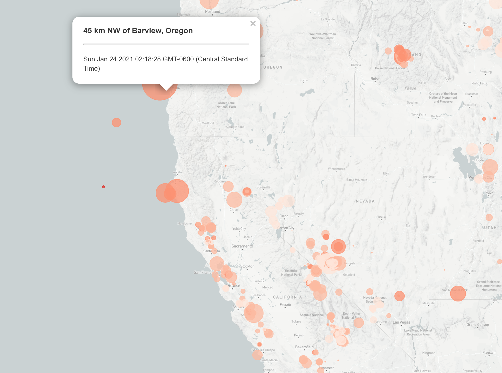

# Leaflet Homework - Visualizing Data with Leaflet

## Background

The dataset that will be analyzed in a **Leaflet**/**Mapbox** map is from the United States Geological Survey, or USGS. The USGS is responsible for providing scientific data about natural hazards, the health of our ecosystems and environment; and the impacts of climate and land-use change. Those who work at USGS develop new methods and tools to supply timely, relevant, and useful information about the Earth and its processes. 

The USGS is interested in building a new earthquake visualization based on their existing [API](https://www.usgs.gov/products/data-and-tools/apis). In order to fully utilize the massive amount of data they collect, a visualization is being proposed in order to further educate the public and other organizations. 

## Navigating the Repository
In this repository, the main directory folder contains the code used to create the map, which is made up of **HTML**, **CSS**, and **JavaScript** files. The *logic.js* folder contains the majority of the code usesd to create an interactive and interesting map. 

## The Task

The main idea of this assignment was to visualize an earthquake dataset. 

    

1. **Get your data set**

    The USGS provides earthquake data in a number of different formats, updated every 5 minutes at the [USGS GeoJSON Feed](http://earthquake.usgs.gov/earthquakes/feed/v1.0/geojson.php) page. Upon selecting a dataset, a JSON representation of data is provided. This url was then used to pull data for the visualization.

    
2. **Import & Visualize Data**

    A map was created using Leaflet which plots all of the earthquakes from the dataset based on their latitude and longitude. The magnitude of the earthquake is represented on the map by sequential colors and the depth is represented by marker size.

    Additionally, popups appear when a marker is clicked which provide other useful data about the seismic activity. A legend that provides context for the colors is also included. 

## Level 2: More Data

    

    A second data set has been added to the map to show tectonic plate boundaries, in order to illustrate how seismic activity occurs on the boundaries of plates. The second dataset was found at <https://github.com/fraxen/tectonicplates>.

    Other improvements to the basic map were the additions of layer controls for multiple baseMaps and the earthquake and tectonic plate boundary datasets. 

